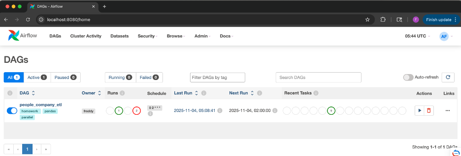
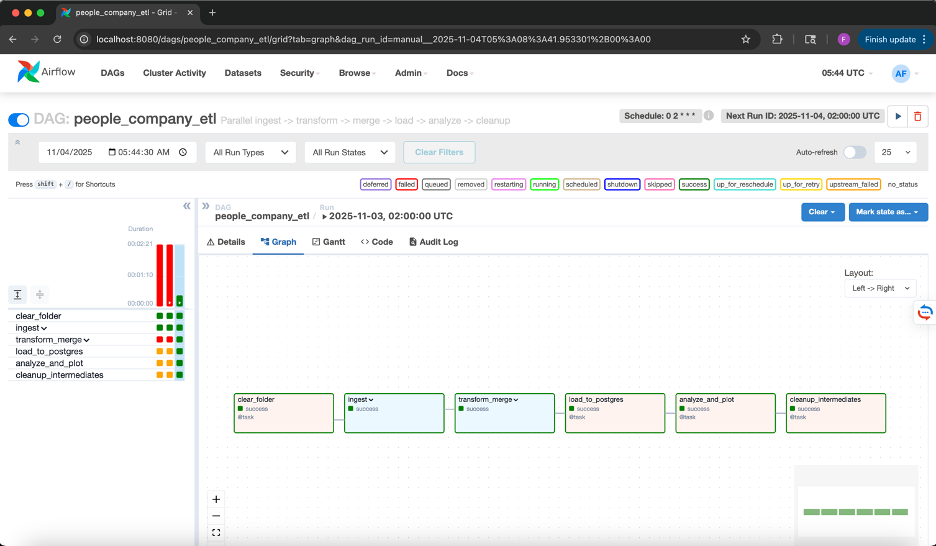
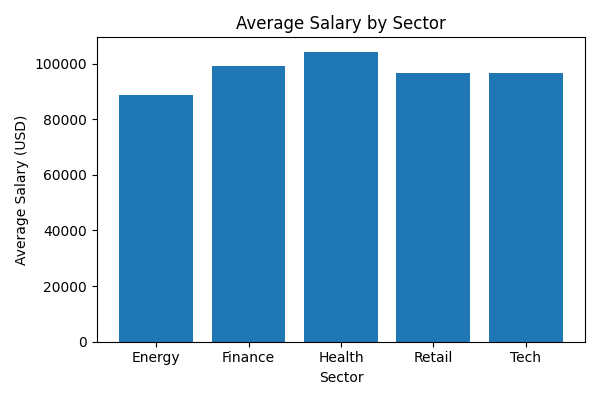

# Airflow Homework: People-Company ETL Pipeline

This project demonstrates an **end-to-end ETL pipeline orchestrated with Apache Airflow**. The pipeline automatically **ingests, transforms, merges, and analyzes** two related datasets (companies and employees) while showcasing **parallel task execution**, **PostgreSQL integration**, and **automated cleanup** within a containerized Airflow environment.

---

## Project Overview

The goal of this pipeline is to simulate a real-world data workflow that connects multiple sources and performs analytical processing. Using Airflow, we build a Directed Acyclic Graph (DAG) that runs daily and automates the following steps:

1. **Data Ingestion (Parallel Tasks)**
   Two datasets are generated in parallel using the Python `Faker` library:

   * `companies.csv`: contains company IDs, names, and sectors.
   * `persons.csv`: contains employee information including salary, email, and associated company ID.

2. **Data Transformation & Merging**
   Each dataset is cleaned (deduplication, normalization, and validation), then merged on `company_id`. The merged dataset is saved as `people_companies.csv`.

3. **Data Loading**
   The final merged dataset is loaded into **PostgreSQL** using SQLAlchemy. The table `public.people_companies` is created and replaced at each run.

4. **Data Analysis & Visualization**
   A summary chart is generated showing the **average salary by sector**, saved as `avg_salary_by_sector.png`.

5. **Cleanup**
   All intermediate data (raw and staged CSVs) are automatically deleted, keeping only the final outputs in the `/data/reports` folder.

---

## Architecture & Components

* **Orchestration:** Apache Airflow (DAG + TaskGroups)
* **Data Storage:** PostgreSQL (Docker service `db`)
* **Transformations:** Pandas and NumPy
* **Visualization:** Matplotlib
* **Containerization:** Docker Compose (webserver, scheduler, Postgres)

The pipeline leverages **parallelism** through Airflow’s TaskGroups for concurrent ingestion and transformation. Tasks communicate only via **file paths (XCom)** (not large datasets) to follow best practices in distributed data workflows.

---

## Directory Structure

```
.
├── dags/
│   └── pipeline.py
├── data/
│   ├── raw/
│   ├── stage/
│   └── reports/avg_salary_by_sector.png
├── screenshots/
│   ├── Airflow-DAG-Page.png
│   ├── Graph-view.png
│   └── output-visualization.png
├── docker-compose.yml
├── .env
├── requirements.txt
└── README.md
```

---

## How to Run

```bash
# Start Airflow + PostgreSQL services
docker compose up -d db airflow-webserver airflow-scheduler

# (Optional) Initialize database on first run
docker compose run --rm airflow-webserver airflow db init
docker compose run --rm airflow-webserver airflow users create \
  --username admin --password admin \
  --firstname Air --lastname Flow \
  --role Admin --email admin@example.com

# Trigger DAG manually
docker compose exec airflow-webserver airflow dags trigger people_company_etl
```

Then visit **[http://localhost:8080](http://localhost:8080)** and log in with:

```
username: admin
password: admin
```

You’ll see the DAG named **`people_company_etl`**. It’s scheduled to run daily at 2:00 AM.

---

## DAG Breakdown

| Step                      | Description                                          | Output                                   |
| ------------------------- | ---------------------------------------------------- | ---------------------------------------- |
| **clear_folder**          | Cleans old files from `raw/` and `stage/`            | —                                        |
| **ingest**                | Generates companies and persons datasets in parallel | `/data/raw/*.csv`                        |
| **transform_merge**       | Cleans + merges both datasets                        | `/data/stage/people_companies.csv`       |
| **load_to_postgres**      | Loads merged data into PostgreSQL                    | Table `people_companies`                 |
| **analyze_and_plot**      | Aggregates salaries by sector & plots chart          | `/data/reports/avg_salary_by_sector.png` |
| **cleanup_intermediates** | Deletes temp data; keeps only final outputs          | —                                        |

---

## Screenshots

### Airflow DAGs Page



### Graph View



### Output Visualization




---

## Key Takeaways

* **Parallelism:** The `ingest_group` and `transform_merge` TaskGroups demonstrate concurrent processing for faster execution.
* **Reproducibility:** Containerized environment ensures consistent setup across systems.
* **Maintainability:** Each step is modular, allowing future substitution (e.g., PySpark, API ingestion, or ML model training).
* **Data Integrity:** Only cleaned and merged results are loaded to Postgres.

---

**Author:** Freddy Platinus

**Date:** November 2025
